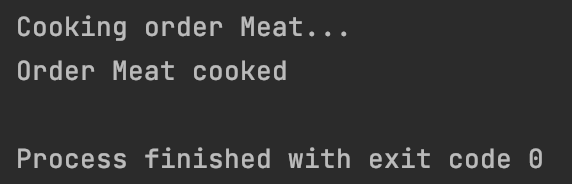
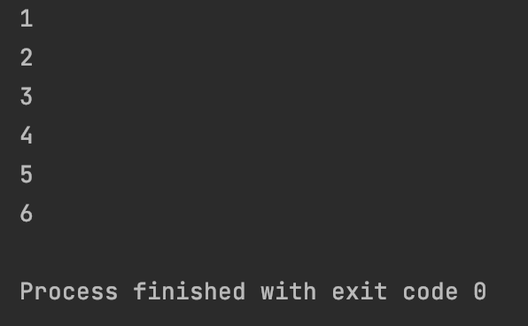
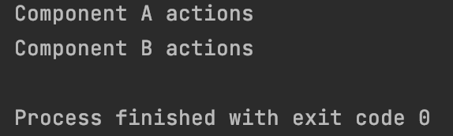
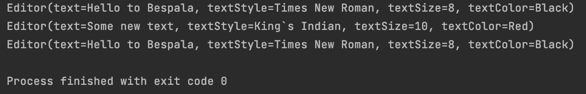
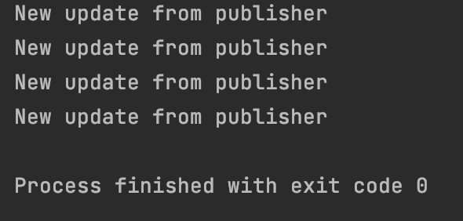
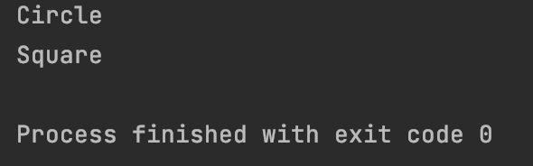
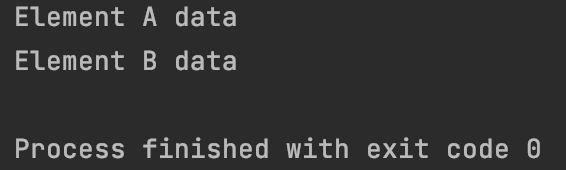

#Behaviral Patterns

In this project presented all behavioral patterns with simple realization. 
These examples are more for visual representation of how they are working.
These examples are small part of all power of patterns. 
Each package represents each pattern.

Patterns menu:

-[Chain of Responsibility](src/main/java/chain_of_responsibility)

-[Command](src/main/java/command)

-[Iterator](src/main/java/iterator)

-[Mediator](src/main/java/mediator)

-[Memento](src/main/java/memento)

-[Observer](src/main/java/observer)

-[State](src/main/java/state)

-[Strategy](src/main/java/strategy)

-[Visitor](src/main/java/visitor)

